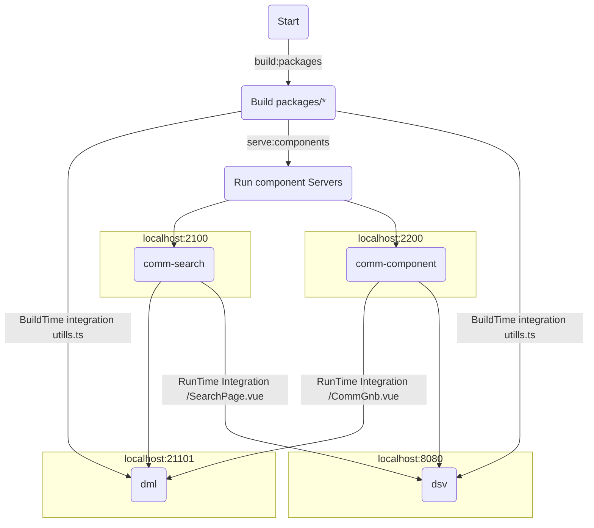

# vue-cli@5.x.x Module Federation

### git Pull then,
```bash
 yarn install
```
 
### comm-components
Init and start Remote(Provider) app
```bash
cd comm-components;
yarn serve
```

### App general (host)
Init and start Host(Consumer) app
```bash
cd dml;
yarn serve;
```
After that open
http://localhost:21101

More information [./app-general/README.md](./app-general/README.md)


## 목적
```
monoRepo vue3-module-fedration Enterprise boilerplate 구축 
- MonoRepository(yarn-berry)
- RunTime Integration
- BuildTime Integration
```
 


## use
Name         | Version    |
:------      | :------    |
`webPack`    | ^5.0.0     | 
`Vue`        | ^3.2.13    | 
`Node`       | 16.14.2    |   
`yarn berry` | 3.2.0      |  
`tsc`        | 4.5.4      |
`@vue/cli`   | 5.0.3      |

## plugins
- ESLint
- Vetur
- Prettier


## module-fedration Enterprise boilerplate 실행&배포과정



 ## module-fedration프로젝트 구조.
~~~
--applications
    ㄴ dml : 쇼핑몰 프로젝트
    ㄴ dsv : 고객센터 프로젝트

--components
    ㄴ comm-components : 공통 컴포넌트
    ㄴ comm-search : 통합검색 컴포넌트

--packages
    ㄴ lru-cache : LruCache 패키지
    ㄴ mock-service : MockService 패키지
    ㄴ type-utils : 유틸 패키지
~~~

## installs
- nvm use 16.14.2 or install
- npm install --global yarn
- yarn set version berry
- npm install @vue/cli@5.0.3 -g (@vue/cli 5.0.3 - Optional)
- npm install typescript@4.5.4 -g
- yarn plugin import workspace-tools

## Execute
  -  move to Root : cd ../
```bash
     - yarn install
```

  -  move to comm-components : cd ../components/comm-components
 ```bash
  - yarn build
  - yarn start
```

 -  move to dml :  cd ../applications/dml
```bash
  - yarn build
  - yarn start 
```


## RunTime Integration
 - components/*

## BuildTime Integration
 - packages/*


## 실무적용과정에서 맞닥드릴 문제들.
 1. 구성원들이 새로운 환경에 이질감을 감당 할 수 있는가.
    - federation Module Server(components)가 항상 구동 되고 있어야 한다던지.


## Ref
