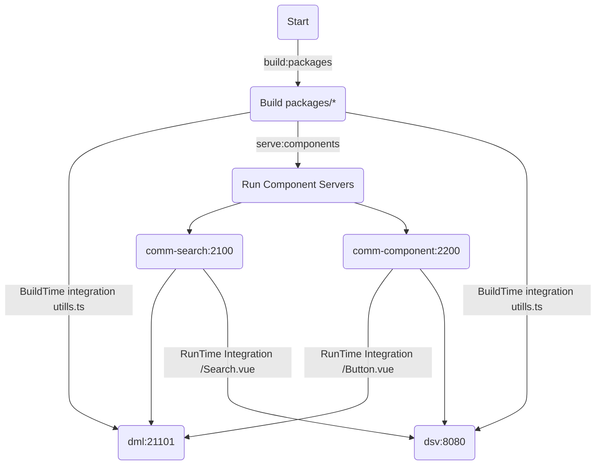

## 목적
```
공식샘플에서 제공되는 코드는 general샘플로 최소설정으로 제공(webpack manual assemble).
현업에서 주로 사용되는 vue-cli-serve, TypeScript, esLint, Prettier, monoRepository패턴 등을
적용한 vue3-module-fedration Enterprise boilerplate 구축
```
[공식샘플](https://github.com/module-federation/module-federation-examples)


## use
Name         | Version    |
:------      | :------    |
`webPack`    | ^5.0.0     | 
`Vue`        | ^3.2.13    | 
`Node`       | 16.14.2    |   
`yarn berry` | 3.2.0      |  
`tsc`        | 4.5.4      |
`@vue/cli`   | 5.0.3      |

## plugins
- ESLint
- Vetur
- Prettier


## module-fedration Enterprise boilerplate 실행&배포과정



 ## module-fedration프로젝트 구조.
~~~
--applications
    ㄴ dml : 쇼핑몰 프로젝트
    ㄴ dsv : 고객센터 프로젝트

--components
    ㄴ comm-components : 공통 컴포넌트
    ㄴ comm-search : 통합검색 컴포넌트

--packages
    ㄴ lru-cache : LruCache 패키지
    ㄴ mock-service : MockService 패키지
    ㄴ type-utils : 유틸 패키지
~~~


## RunTime Integration
 - components/*

## BuildTime Integration
 - packages/*


## (!작업중!) 누군가 본다면 이해하려 하지말것.
## (!trying!)If someone sees you at work, don't try to understand.

