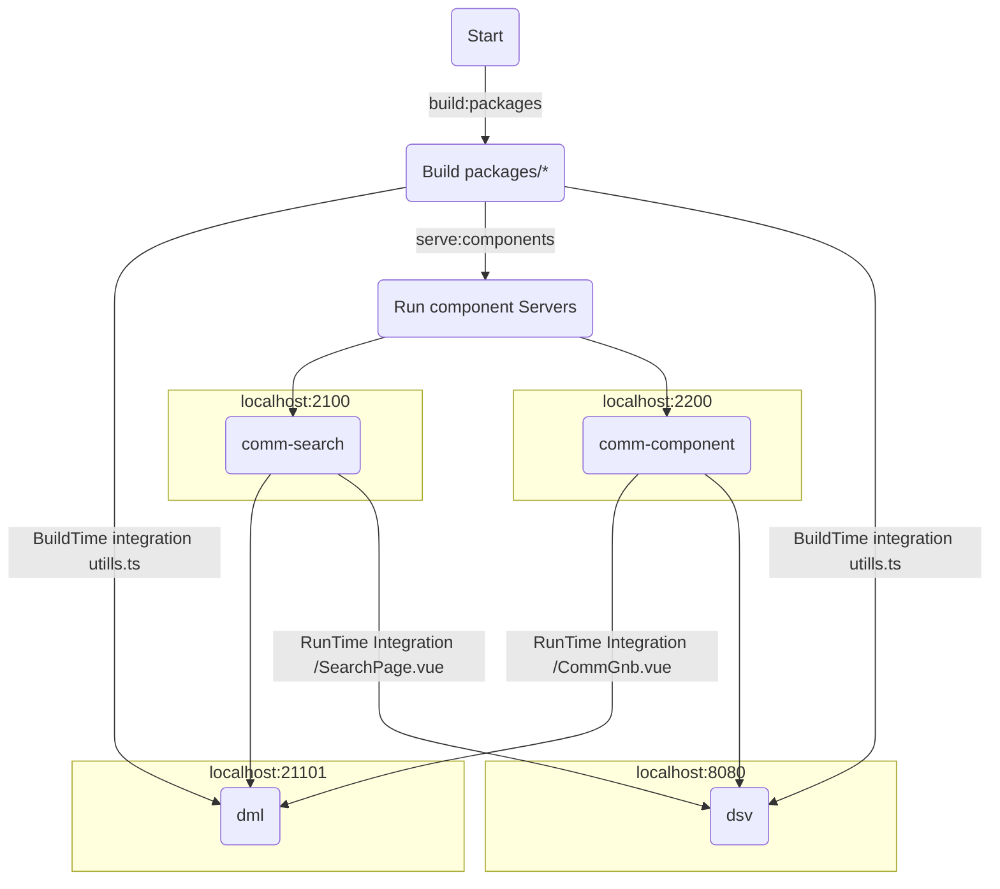

## 목적
```
공식샘플에서 제공되는 코드는 general샘플로 최소설정으로 제공(webpack manual assemble).
현업에서 주로 사용되는 vue-cli-serve, TypeScript, esLint, Prettier, monoRepository패턴 등을
적용한 vue3-module-fedration Enterprise boilerplate 구축
```
[공식샘플](https://github.com/module-federation/module-federation-examples)


## use
Name         | Version    |
:------      | :------    |
`webPack`    | ^5.0.0     | 
`Vue`        | ^3.2.13    | 
`Node`       | 16.14.2    |   
`yarn berry` | 3.2.0      |  
`tsc`        | 4.5.4      |
`@vue/cli`   | 5.0.3      |

## plugins
- ESLint
- Vetur
- Prettier


## module-fedration Enterprise boilerplate 실행&배포과정



 ## module-fedration프로젝트 구조.(22.03.25 기준)
~~~
--applications
    ㄴ dml : 쇼핑몰 프로젝트
    ㄴ dsv : 고객센터 프로젝트 (추가예정)

--components
    ㄴ comm-components : 공통 컴포넌트
    ㄴ comm-search : 통합검색 컴포넌트 (추가예정)

--packages
    ㄴ lru-cache : LruCache 패키지
    ㄴ mock-service : MockService 패키지
    ㄴ type-utils : 유틸 패키지
~~~


## Just Follow Me (22.03.25 기준 OK)
  -  move to Root : cd ../
```bash
     - yarn install
```

  -  move to comm-components : cd ../components/comm-components
 ```bash
  - yarn build
  - yarn start
```

 -  move to dml :  cd ../applications/dml
```bash
  - yarn build
  - yarn start 
```


## RunTime Integration
 - components/*

## BuildTime Integration
 - packages/*


## 실무적용과정에서 맞닥드릴 문제들.
 1. 구성원들이 새로운 환경에 이질감을 감당 할 수 있는가.
    - federation Module Server(components)가 로컬,개발기,스테이지,운영에 항상 구동 되고 있어야 한다던지.
 2. 도메인모듈 담당인원이 충분한가.
    - 소수의 개발자가 어려 모듈을 개발해야 할 경우 개발 복잡도 증가.(MSA Server개발 시 겪는 문제와 같음) 


 ## 나라면 이렇게 구성 할 것
  1. 작은 단위에 컴포넌트는 BuildTime Integration
  2. 페이지별, 도메인별 통합된 독립 기능을 제공 할때 


## (!작업중!) 누군가 본다면 이해하려 하지말것.
## (!trying!)If someone sees you at work, don't try to understand.


## Ref
 - https://github.com/module-federation/fmr
 - Federated Module Reloading : https://medium.com/@A__G__B/introducing-fmr-federated-module-reloading-820ec56256db
   ext : https://chrome.google.com/webstore/detail/module-federation-live-re/likboddddbpaicmnhpddhhjeclggkejj
