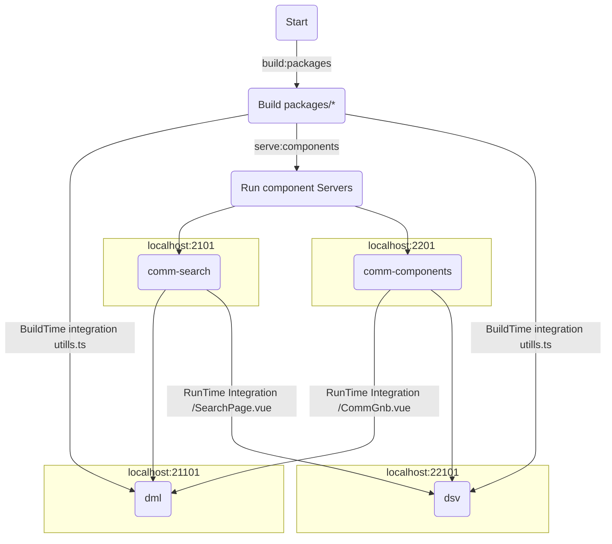

# vue3-cli@5.x.x Module Federation


## module-fedration Enterprise boilerplate 실행&배포과정


### just Follow Me
## installs
- nvm use 16.14.2 or install
- npm install @vue/cli@5.0.4 -g (Optional)
- npm install typescript@4.5.4 -g
- npm install --global yarn

- (root) yarn set version berry
- (root) yarn plugin import workspace-tools


## execute
```bash
 yarn install
 yarn serve:comm
 yarn serve:dml
``` 
After that open
http://localhost:21101
tada!!


## CommGnb Hot Reload Update(remote)
 test : update Gnb Text Mall -> Shopping Mall


## use
Name         | Version    |
:------      | :------    |
`webPack`    | ^5.x     | 
`Vue`        | ^3.2.13    | 
`Node`       | 16.14.2    |   
`yarn berry` | 3.2.0      |  
`tsc`        | 4.5.4      |
`@vue/cli`   | 5.0.4      |

## plugins
- ESLint
- Volar v0.34.6
- gitLens


 ## module-fedration with MonoRepository Structure.(22.03.25)
~~~
--applications
    ㄴ dml : Shopping Mall Project 
    ㄴ dsv : customer Service Project (leave it blank for you try it)

--components
    ㄴ comm-components : 공통 컴포넌트
    ㄴ comm-search : 통합검색 컴포넌트 (leave it blank for you try it)

--packages
    ㄴ lru-cache : LruCache 패키지
    ㄴ mock-service : MockService 패키지
    ㄴ type-utils : 유틸 패키지
~~~

## RunTime Integration
 - components/*

## BuildTime Integration
 - packages/*


## 적용과정에서 맞닥드릴 문제들.
 - remote의 i18n 공유 및 처리 -> 해결
 - 무엇을 어디까지 공유 해야 할까.
 - 구성원들이 새로운 환경에 대한 이질감
    - federation Module Server(components)가 항상 구동 되고 있어야 한다던지.
 - 조직내에서 서비스별 컴포넌트 공유 규칙 필요
 

## Ref
