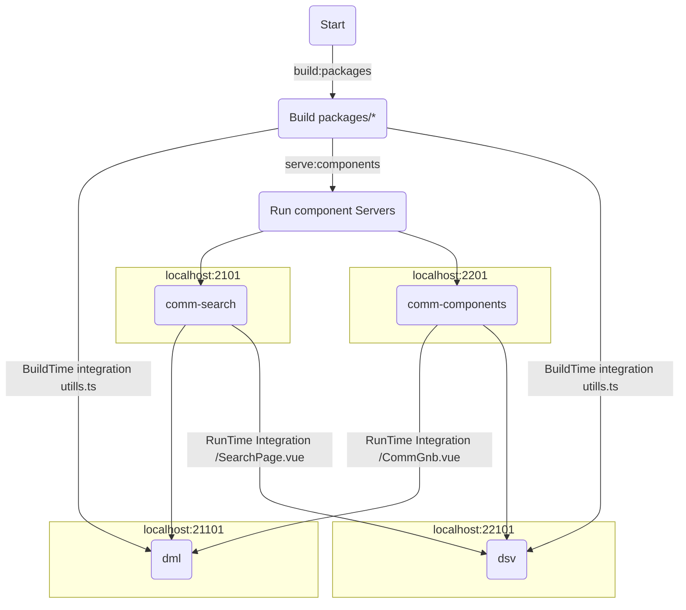

# vue3-cli@5.x.x Module Federation


## module-fedration Enterprise boilerplate 실행&배포과정


### just Follow Me
## installs
- nvm use 16.14.2 or install
- npm install @vue/cli@5.0.3 -g (@vue/cli 5.0.3 - Optional)
- npm install typescript@4.5.4 -g
- npm install --global yarn

- (root) yarn set version berry
- (root) yarn plugin import workspace-tools


## execute
```bash
 yarn install
 yarn serve:comm
 yarn serve:dml
```
 
After that open
http://localhost:21101
tada!!


## use
Name         | Version    |
:------      | :------    |
`webPack`    | ^5.0.0     | 
`Vue`        | ^3.2.13    | 
`Node`       | 16.14.2    |   
`yarn berry` | 3.2.0      |  
`tsc`        | 4.5.4      |
`@vue/cli`   | 5.0.3      |

## plugins
- ESLint
- Vetur
- Prettier


 ## module-fedration프로젝트 구조.(22.03.25 기준)
~~~
--applications
    ㄴ dml : 쇼핑몰 프로젝트
    ㄴ dsv : 고객센터 프로젝트 (추가예정)

--components
    ㄴ comm-components : 공통 컴포넌트
    ㄴ comm-search : 통합검색 컴포넌트 (추가예정)

--packages
    ㄴ lru-cache : LruCache 패키지
    ㄴ mock-service : MockService 패키지
    ㄴ type-utils : 유틸 패키지
~~~


## RunTime Integration
 - components/*

## BuildTime Integration
 - packages/*


## 실무적용과정에서 맞닥드릴 문제들.
 1. 구성원들이 새로운 환경에 이질감을 감당 할 수 있는가.
    - federation Module Server(components)가 항상 구동 되고 있어야 한다던지.
 2. 조직내에서 서비스별 체계나 규약없이 모듈 공유 시 관리가 어려워 질 수 있다.  
 

## Ref
