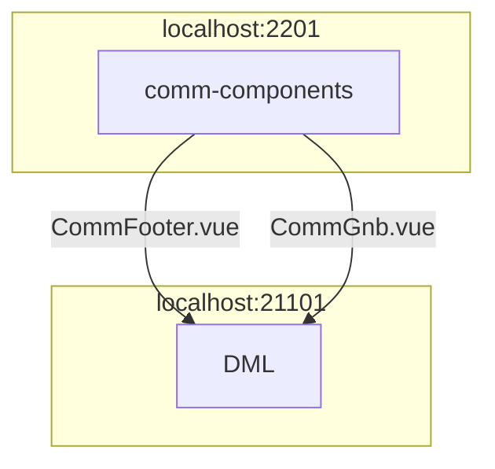
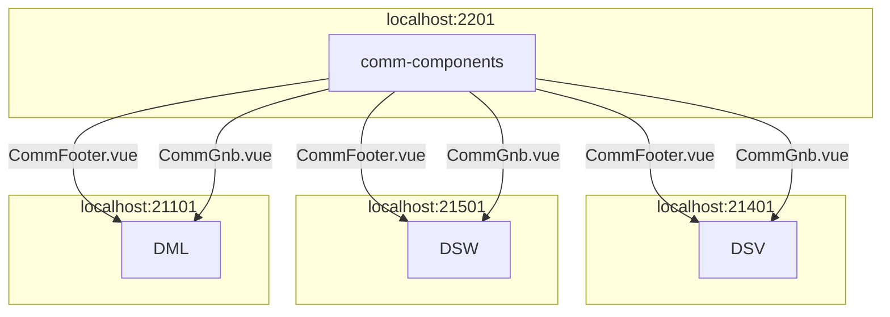

# comm-components

### Notice
```bash
  App running at:
  - Local:   http://localhost:2201
```

http://localhost:2201/ - is actual


## now

```mermaid
graph TB
comm-components --CommFooter.vue--> DML
comm-components --CommGnb.vue--> DML

subgraph localhost:21101
DML
end
subgraph localhost:2201
comm-components
end
```

## Future

```mermaid
graph TB
comm-components --CommFooter.vue--> DML
comm-components --CommGnb.vue--> DML

comm-components --CommFooter.vue--> DSV
comm-components --CommGnb.vue--> DSV

comm-components --CommFooter.vue--> DSW
comm-components --CommGnb.vue--> DSW


subgraph localhost:2201
comm-components
end


subgraph localhost:21401
DSV
end

subgraph localhost:21501
DSW
end

subgraph localhost:21101
DML
end


```